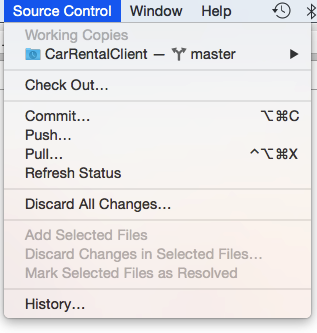
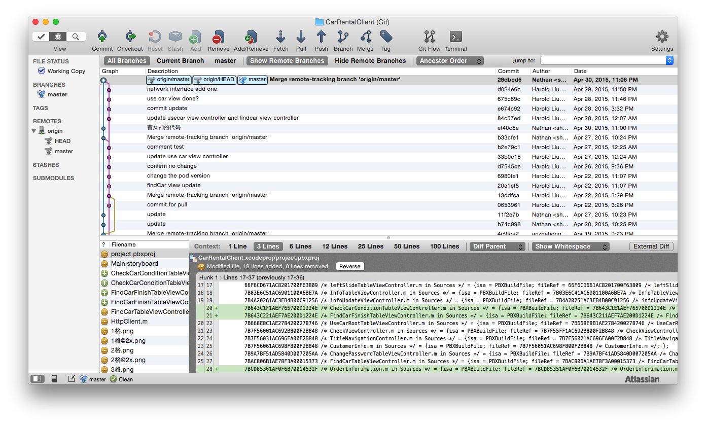

# Test-Project-For-Cocos2dx
## Description
- This project is cocos2d-x game demo. 
- The cocos library is not included in this respository. You need to add it manually.

## Development Environment
- Xcode 6.2

## Operating Environment
- iOS 8.2(Above 8.0 is all accepted)

# 附：Git简单使用

##测试远端仓库地址
[https://github.com/Nathan1994/Test-Project-For-Cocos2dx](https://github.com/Nathan1994/Test-Project-For-Cocos2dx)

##准备
- [Github Account](http://www.github.com)
- Terminal
- Xcode
- [Source Tree(Optional)](http://www.sourcetreeapp.com/)
- [Skype & Account](http://skype.gmw.cn/)(这个跟Git无关、联系的时候会比较好用、顺便列在这里了)
- Across the Great Firewall(翻墙!!! 不翻墙pull和push巨慢！)

##Git常用指令
- clone:将远端仓库克隆到本地
- commit：提交变动（本地）
- pull：更新本地仓库（跟远端仓库对照）
- push：将本地仓库提交到远端仓库

##Git工具
### 1.Terminal
- cd ~/Desktop
- git clone 
- git add
- git commit
- git pull
- git push

### 2.Xcode（Recommend）

### 2.Source Tree（More Powerful）

(我用的旧版的、新版的界面会不太一样)
